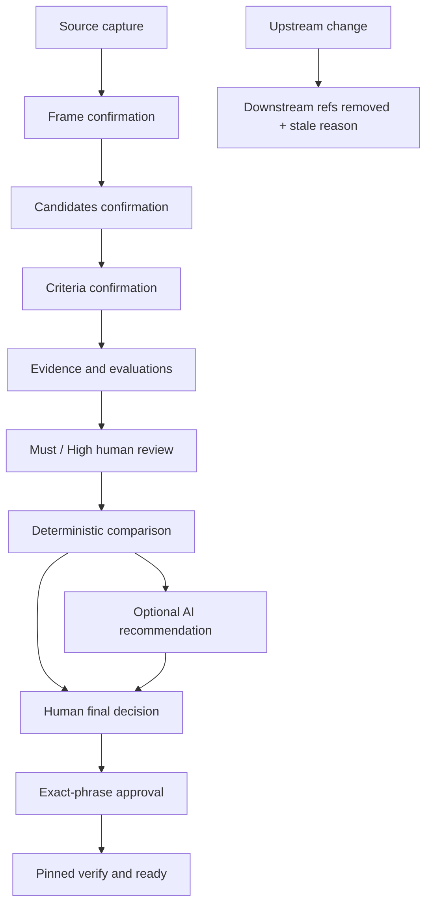

# AI Work Harness

[](https://github.com/5giran/ai-work-harness/actions/workflows/ci.yml)

[한국어](README.md) · [English](README.en.md)

**A local decision harness that keeps AI evaluation and recommendations inside a
human-confirmed problem, candidate, criteria, and evidence boundary.**

AI Work Harness does not let AI make the decision. AI can draft evaluations and a
recommendation; a person confirms the decision contract, reviews important cells, records the
final decision, and approves it. When an input or criterion changes, the old decision is not
silently reused: its downstream references are removed and the reason is recorded as stale.

[Project overview](#project-overview) · [Quick start](#quick-start) · [Workflow](#workflow) ·
[Advanced / Automation](#advanced--automation) · [Verification](#verification) ·
[Project story](docs/project-story.md)

> The current release is `0.5.0` alpha for one local operator. It does not claim identity
> authentication, a signed ledger, protection against a malicious full local rewrite, or a
> production-ready remote service.

## Project overview

### Problem it addresses

Fast AI analysis and recommendations still leave operational questions unanswered:

- What problem was being solved, and who confirmed that framing?
- Which candidates were compared against which criteria and source-backed evidence?
- Why did the human choose something different from the AI recommendation?
- Is an old approval still valid after an input, criterion, or evaluation changes?

AI Work Harness enforces answers with schemas, immutable snapshots, state transitions, and a
verifier rather than relying on documentation convention. It targets reviewable choices—such as
an operating model, model adoption, or internal tool selection—where **AI assistance is useful but
decision accountability must remain human**.

An operator starts or resumes the decision through one guided command:

```bash
ai-work-harness --root /path/to/project decision guide triage-ops --lang en
```

The guide presents only the next required action and carries snapshot hashes, artifact digests,
challenge IDs, and nonces internally. The explicit raw protocol remains available as a separate
automation and forensic interface.

### Core guarantees

| Boundary | Implemented control |
|---|---|
| Human authority | Frame, candidate, and criteria confirmation; Must/High review; final decision; and approval are separate events. |
| AI authority | Providers and MCP create evaluation or recommendation drafts but cannot access human gates. |
| Evidence | Source bytes and line locators are SHA-256-bound; inference and user assertions remain distinct from observations. |
| Recommendation vs. decision | Recommendations are non-binding; the human relationship is recorded as `same`, `different`, or `no_recommendation`. |
| Change detection | An upstream change removes downstream active refs and records a precise stale reason. |
| Concurrent writes | Full-parent CAS, a five-second lock, and atomic pointer replacement prevent automatic reapplication. |
| Approval | The challenge binds the bundle digest, snapshot, nonce, disposition, and expiry. |
| Semantic verification | Rechecks reached-stage gates, evidence, evaluations, reviews, derived comparison, and final-decision rules on the pinned snapshot. |
| Readiness | `ready=true` requires an approved `select` and full verification of that same pinned snapshot. |

### Background

The project began as a problem-adaptive harness for
[2026 Cofathon](https://cofathon.getcofa.com/). Its v1 workflow preserved the prompt, confirmed
the problem frame, and prevented implementation from starting on an unapproved route.

The same problem remained after the event. The more work was delegated to AI, the harder it
became to answer: What evidence supported the recommendation? Why did the human choose
something else? Is the approval still valid after the criteria changed? The route selector
therefore became a reusable decision control plane.

The portfolio evidence is the engineering response to two problems found through real use:

- a safe raw protocol was too cumbersome for a person, so it gained a resumable guided CLI;
- AI advice and human accountability were easy to blur, so they became separate artifacts,
  gates, and verification rules.

See [Project story](docs/project-story.md) for the longer history and claim boundaries.

### Technology

- Python 3.11/3.12, frozen dataclasses, and JSON Schema Draft 2020-12
- RFC 8785 JCS and a SHA-256 content-addressed object/immutable snapshot store
- Optional OpenAI Responses API adapter and official-Python-SDK stdio MCP server
- Read-only offline viewer built with Vite, Vanilla TypeScript, Ajv, and Playwright

## Quick start

### Install

Python 3.11 or 3.12 is required.

```bash
git clone https://github.com/5giran/ai-work-harness.git
cd ai-work-harness
python -m venv .venv
.venv/bin/pip install -e '.[dev]'
```

### Start or resume a decision

```bash
.venv/bin/ai-work-harness \
  --root /absolute/path/to/local-project \
  decision guide triage-ops \
  --lang en
```

- A missing session is created only after a `y/N` prompt shows its root and ID.
- Running the same command resumes from the verified current stage.
- The guide carries snapshot hashes, artifact digests, challenge IDs, and nonces internally.
- Semantic confirmation, Must/High review, OpenAI consent, final decision, and approval remain
  human actions.

The guide is a line-oriented TTY, not a full-screen UI. It creates no global active-session
setting, so the project root and session remain explicit.

### Ten-minute synthetic demo

```bash
.venv/bin/python scripts/run_synthetic_decision_demo.py \
  --test-operator \
  --lang en
```

Remove `--test-operator` to answer the guide yourself. The deterministic test operator is CI
input, not evidence of a human identity or human review.

One guide invocation demonstrates:

- `rules`, `classical-ml`, and `llm-assisted` candidates;
- human review of Must privacy/auditability and High classification quality;
- Fixture recommendation `classical-ml` versus human selection `rules`;
- acknowledgement of the selected option's unresolved and unreviewed risks;
- exact-phrase approval and a `ready=true` viewer export;
- criteria change, approval removal, `ready=false`, and `criteria_set_changed`.

The operator manually copies zero cryptographic values.

## Workflow



Artifacts and snapshots are addressed by SHA-256 over RFC 8785 JCS bytes.

```text
.ai-work-harness/v2/
├── objects/sha256/<prefix>/<digest>
└── sessions/<session-id>/
    ├── snapshots/<prefix>/<snapshot-digest>.json
    ├── current.json
    └── writer.lock
```

Only `current.json` points to active state. A mutation fsyncs objects and the snapshot before
atomically replacing that pointer. Crash orphans cannot become active state; `decision doctor`
reports them but does not garbage-collect them. It reports a remaining writer lock separately
from storage integrity and never removes it automatically. See the
[recovery procedure](docs/operator-runbook.md#5-충돌과-실패-복구).

## OpenAI, MCP, and viewer

Install only the integrations you need:

```bash
.venv/bin/pip install -e '.[openai,mcp]'
```

- `FixtureProvider` creates deterministic evaluation and recommendation payloads offline.
- Before OpenAI, the guide displays provider, model, prompt/input fingerprints, source excerpt
  bytes, and evidence count. No external request occurs before exact
  `SEND OPENAI <fingerprint>` consent.
- OpenAI requests use the fixed `https://api.openai.com/v1` endpoint. Other `OPENAI_BASE_URL`
  values are rejected before consent; the actual client endpoint is also checked before every
  request. Custom endpoints are unsupported.
- After timeout or refusal, the operator can retry the same consented manifest or choose a
  local/agent import. A changed manifest requires new consent; there is no automatic fallback.
- The stdio MCP allowlist contains no confirm, review, final-decision, challenge, or approval
  tool.
- The offline viewer reads one exported `decision-view.v1.json`. Schema or digest failure hides
  all decision content and shows corruption instead.

See [Provider policy](docs/provider-policy.md). Pull-request CI never calls a live provider; a
protected manual workflow allows one synthetic request.

## Advanced / Automation

The guide is an adapter over the unchanged raw contract. Raw v2 JSON, MCP, and legacy v1 remain
available for automation and forensic operation.

Read the current sanitized plan without interpreting raw refs:

```bash
ai-work-harness --root "$ROOT" decision next --session-id "$SESSION"
```

`operator-plan.v1` returns recommended and available actions, pending reviews, final-decision
constraints, and sanitized challenge state. It excludes nonces, full challenge bindings, raw
sources, and excerpts.

Raw mutations still require the full parent digest:

```bash
ai-work-harness --root "$ROOT" decision source capture \
  --session-id "$SESSION" \
  --expected-parent <full-snapshot-sha256> \
  ...
```

Expected domain results and failures use stable JSON envelopes and exit codes. Raw approval
commit still requires the challenge ID, nonce, and full bundle digest. See the Advanced section
of the [Operator runbook](docs/operator-runbook.md).

Export the verified current snapshot without passing `--snapshot`:

```bash
ai-work-harness --root "$ROOT" decision export-view \
  --session-id "$SESSION" \
  --output /absolute/path/decision-view.v1.json
```

Use `--snapshot <full-sha256>` only for a forensic historical export.

### Legacy v1

The original `init`, `capture`, `frame`, `route`, `approve`, `status`, and `verify` commands keep
their v1 meaning. v2 is never auto-detected. `decision migrate-v1` does not promote a v1 boolean
confirmation or free-text approval into a v2 human gate.

## Verification

```bash
.venv/bin/ruff check .
.venv/bin/ruff format --check .
.venv/bin/mypy src/ai_work_harness
.venv/bin/pytest --cov=ai_work_harness --cov-report=term-missing --cov-fail-under=90
.venv/bin/python -m build

cd viewer
npm ci
npm test
npm run build
npm run test:e2e
```

CI covers Python 3.11/3.12 lint, typing, 90% coverage, sdist/wheel, a one-invocation guided
demo, and clean-wheel smoke on Python 3.12 for Ubuntu, macOS, and Windows. The viewer uses Node
22 unit/build checks and Playwright Chromium E2E.

The [Portfolio evidence map](docs/evidence-map.md) links claims to reproducible tests, including
raw/guided graph equivalence, conflict behavior, immutable revision requests, exact outbound
consent, provider-failure pointer safety, `ready => verify`, and viewer tamper rejection.

## Documentation

- [Project story](docs/project-story.md)
- [Architecture](docs/architecture.md)
- [Data contract](docs/data-contract.md)
- [Operator runbook](docs/operator-runbook.md)
- [Provider policy](docs/provider-policy.md)
- [Threat model](docs/threat-model.md)
- [Architecture decisions](docs/adr/README.md)

## Scope and limits

The current scope is one local operator, UTF-8 text/Markdown evidence, and qualitative
comparison. SHA-256 and JCS detect drift and corruption; they do not prove authorship or resist
a malicious rewrite of the entire local repository.

Remote MCP, authentication/signatures, database or cloud backend, hosted viewer, RAG,
multimodal input, numeric scoring, optimization, automatic GC, and PyPI publication are out of
scope.

## License

[MIT](LICENSE)
