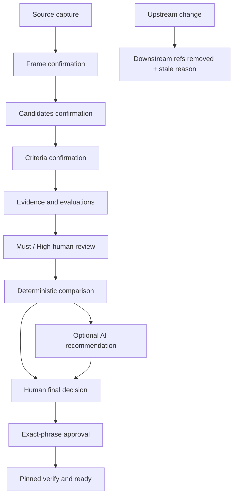

# AI Work Harness

[](https://github.com/5giran/ai-work-harness/actions/workflows/ci.yml)

[한국어](README.md) · [English](README.en.md)

**사람이 확정한 문제·후보·기준과 출처가 있는 근거 안에서 AI가 평가와 추천을 만들도록
통제하는 로컬 의사결정 하네스**

```bash
ai-work-harness --root /path/to/project decision guide triage-ops
```

AI Work Harness는 AI가 결정을 대신하게 하지 않는다. AI는 초안을 만들고, 사람은 문제를
확인하고 평가를 검토하며 최종 결정과 승인을 기록한다. 입력이나 기준이 바뀌면 이전 결정은
조용히 재사용되지 않고 정확한 사유와 함께 stale 처리된다.

> 현재 버전은 `0.5.0` alpha다. 로컬 단일 운영자용 도구이며 사용자 인증, 서명 원장,
> 악의적 로컬 재작성 방지 또는 production-ready 원격 서비스를 주장하지 않는다.

## 왜 만들었나

이 프로젝트는 [2026 Cofathon](https://cofathon.getcofa.com/)에서 낯선 과제를 안전하게
시작하기 위한 하네스로 출발했다. 원문을 먼저 보존하고, 문제를 확인한 뒤, 승인된 경로에서만
구현하게 한 것이 v1의 역할이었다.

행사 뒤에도 같은 문제가 남았다. AI에게 분석을 맡길수록 “무엇을 근거로 추천했는가”, “사람은
왜 다른 선택을 했는가”, “기준이 바뀐 뒤 이전 승인은 아직 유효한가”를 다시 설명하기
어려웠다. 그래서 실행 경로 선택기를 다음 의사결정을 위한 control plane으로 확장했다.

이 저장소의 포트폴리오 근거는 행사 결과가 아니라, 실제 사용에서 드러난 두 문제를 코드로
해결한 과정에 있다.

- 안전한 raw 프로토콜이 사람에게 너무 복잡했던 문제는 resumable guided CLI로 해결했다.
- AI의 추천과 사람의 책임이 섞이던 문제는 별도 artifact, 인간 gate와 verifier로 분리했다.

긴 배경과 주장 범위는 [프로젝트 이야기](docs/project-story.md)에 정리했다.

## 무엇을 보장하나

| 질문 | 구현된 통제 |
|---|---|
| 누가 문제와 기준을 확정했나? | frame·후보·기준의 초안과 인간 확인을 서로 다른 snapshot으로 기록 |
| AI 평가는 무엇을 인용했나? | source bytes, 1-based line locator와 excerpt SHA-256을 evidence에 binding |
| 중요한 평가를 사람이 봤나? | AI/Fixture Must·High cell에 concur, override 또는 revision 요청 강제 |
| 추천과 최종 선택이 달라도 되나? | 추천은 비구속적이며 인간 결정과의 관계를 `same|different|no_recommendation`으로 기록 |
| 기준이 바뀌면 어떻게 되나? | downstream 활성 ref를 제거하고 `criteria_set_changed` 같은 stale reason 기록 |
| 두 writer가 동시에 쓰면? | full expected-parent CAS, 5초 lock, atomic pointer replace로 자동 재적용 금지 |
| `ready=true`를 믿어도 되나? | 승인된 `select`와 동일 pinned snapshot의 전체 verify가 함께 성공해야 함 |

## 빠른 시작

### 설치

Python 3.11 또는 3.12가 필요하다.

```bash
git clone https://github.com/5giran/ai-work-harness.git
cd ai-work-harness
python -m venv .venv
.venv/bin/pip install -e '.[dev]'
```

### 첫 의사결정 시작

```bash
.venv/bin/ai-work-harness \
  --root /absolute/path/to/local-project \
  decision guide triage-ops
```

- 한국어 화면이 기본이며 `--lang en`으로 영어를 선택한다.
- session이 없으면 root와 ID를 보여준 뒤 생성 여부를 묻는다.
- 중간에 종료해도 같은 명령을 실행하면 검증된 현재 단계부터 재개한다.
- snapshot SHA, artifact digest, challenge ID와 nonce는 guide가 내부에서 전달한다.
- 의미 확인, Must/High 검토, OpenAI 전송 동의, 최종 결정과 승인은 자동화하지 않는다.

guide는 line-oriented TTY이며 full-screen UI나 전역 active session을 만들지 않는다. 따라서
어느 project root와 session을 다루는지 항상 화면에 드러난다.

### 10분 합성 데모

```bash
.venv/bin/python scripts/run_synthetic_decision_demo.py \
  --test-operator \
  --lang ko
```

자동 입력을 빼고 직접 진행하려면 `--test-operator`를 제거한다. 자동 test operator는 CI용
결정 입력일 뿐 실제 인간 신원이나 인간 검토의 증거가 아니다.

데모는 하나의 guide invocation으로 다음을 재현한다.

- 후보 `rules`, `classical-ml`, `llm-assisted` 비교
- Must privacy·auditability와 High classification quality의 인간 검토
- Fixture 추천 `classical-ml`과 인간 선택 `rules`의 정상적인 불일치
- 선택 후보의 High·미검토 Medium 위험 확인
- 정확 문구 승인과 `ready=true` viewer export
- criteria 변경 뒤 승인 제거, `ready=false`, `criteria_set_changed`

사용자가 복사해 붙여넣는 cryptographic value는 없다.

## 작동 방식



artifact와 snapshot은 RFC 8785 JCS bytes의 SHA-256으로 주소화된다.

```text
.ai-work-harness/v2/
├── objects/sha256/<prefix>/<digest>
└── sessions/<session-id>/
    ├── snapshots/<prefix>/<snapshot-digest>.json
    ├── current.json
    └── writer.lock
```

`current.json`만 활성 snapshot을 가리킨다. mutation은 object와 snapshot을 먼저 fsync하고
pointer를 atomic replace한다. crash로 남은 미참조 object는 활성 상태를 바꾸지 않으며
`decision doctor`가 보고만 한다.

## OpenAI, MCP와 Viewer

선택적 integration은 필요한 것만 설치한다.

```bash
.venv/bin/pip install -e '.[openai,mcp]'
```

- `FixtureProvider`는 네트워크 없이 같은 입력에 결정적인 평가·추천을 만든다.
- OpenAI는 provider, model, prompt/input fingerprint, source byte 수와 evidence 수를 먼저
  보여준다. `SEND OPENAI <fingerprint>`가 정확히 입력되기 전에는 외부 호출이 없다.
- timeout·refusal 뒤에는 같은 consented manifest 재시도 또는 local/agent import를 고른다.
  manifest가 달라지면 다시 동의해야 하며 자동 fallback은 없다.
- stdio MCP allowlist에는 confirm, review, final decision, challenge와 approval tool이 없다.
- viewer는 export된 `decision-view.v1.json`만 오프라인에서 읽는다. schema나 digest가 틀리면
  결정 내용을 숨기고 corruption 상태를 표시한다.

정책 세부사항은 [Provider policy](docs/provider-policy.md)에 있다. PR CI는 live provider를
호출하지 않으며, 수동 protected workflow만 합성 데이터로 한 번의 호출을 허용한다.

## Advanced / Automation

guided UX는 기존 raw 계약 위에 놓인 adapter다. raw v2 CLI, JSON envelope, MCP와 v1은
자동화·정밀 운영을 위해 그대로 유지된다.

현재 단계를 읽는 read-only 인터페이스:

```bash
ai-work-harness --root "$ROOT" decision next --session-id "$SESSION"
```

`operator-plan.v1`은 recommended/available action, pending review, final constraint와 sanitized
challenge 상태를 반환한다. nonce, full challenge binding, raw source와 excerpt는 포함하지
않는다.

raw mutation은 계속 full parent를 요구한다.

```bash
ai-work-harness --root "$ROOT" decision source capture \
  --session-id "$SESSION" \
  --expected-parent <full-snapshot-sha256> \
  ...
```

정상 domain 결과와 예상 오류는 stable JSON envelope와 exit code를 사용한다. approval raw
commit도 challenge ID, nonce와 full bundle digest를 계속 요구한다. 전체 명령은
[Operator runbook](docs/operator-runbook.md)의 Advanced 절을 참고한다.

검증된 current snapshot을 viewer로 내보낼 때 `--snapshot`은 생략할 수 있다.

```bash
ai-work-harness --root "$ROOT" decision export-view \
  --session-id "$SESSION" \
  --output /absolute/path/decision-view.v1.json
```

과거 snapshot을 forensic export할 때만 `--snapshot <full-sha256>`를 지정한다.

### legacy v1

기존 `init`, `capture`, `frame`, `route`, `approve`, `status`, `verify`는 v1 의미 그대로
유지된다. v2는 자동 감지하지 않는다. `decision migrate-v1`도 v1의 boolean confirmation이나
자유 문자열 approval을 v2 인간 gate로 승격하지 않는다.

## 검증

```bash
.venv/bin/ruff check .
.venv/bin/ruff format --check .
.venv/bin/mypy src/ai_work_harness
.venv/bin/pytest --cov=ai_work_harness --cov-report=term-missing --cov-fail-under=90
.venv/bin/python -m build

cd viewer
npm ci
npm test
npm run build
npm run test:e2e
```

CI는 Python 3.11/3.12의 lint·type·coverage 90%·wheel/sdist를 검사하고, Python 3.12의
Ubuntu/macOS/Windows clean-wheel smoke와 one-invocation guided demo를 실행한다. viewer는
Node 22에서 unit, production build와 Playwright Chromium E2E를 검증한다.

[Portfolio evidence map](docs/evidence-map.md)은 다음 주장들을 직접 재현하는 테스트로 연결한다.

- prompt와 mutation 사이 writer 경쟁에서도 cursor 불변·자동 retry 없음
- raw/guided artifact payload와 활성 ref graph 동등성
- request revision 불변 기록과 새 evaluation 요구
- OpenAI exact consent 전 network 0회, 실패 뒤 pointer·consent 불변
- `ready=true`인 terminal snapshot의 동일 snapshot verify 성공
- viewer one-byte 변조, 중복 key와 network 요청 거부

## 문서

- [프로젝트 이야기](docs/project-story.md): Cofathon용 v1에서 범용 control plane으로 확장한 이유
- [Architecture](docs/architecture.md): component, pinned read, write protocol과 stale graph
- [Data contract](docs/data-contract.md): artifact schema, evidence, review와 confirmation method
- [Operator runbook](docs/operator-runbook.md): guided 운영, 복구 절차와 raw protocol
- [Provider policy](docs/provider-policy.md): Fixture/OpenAI/MCP 권한과 outbound consent
- [Threat model](docs/threat-model.md): 보장하는 것과 주장하지 않는 것
- [ADR](docs/adr/README.md): 주요 설계 결정과 대안

## 범위와 제한

현재 범위는 로컬 단일 운영자, UTF-8 text/Markdown 근거와 정성 비교다. SHA-256과 JCS는
drift와 손상을 탐지하지만 작성자 신원이나 악의적인 전체 로컬 재작성을 증명하지 않는다.

remote MCP, 인증·서명, DB/cloud backend, hosted viewer, RAG, multimodal, numeric scoring,
optimization, 자동 GC와 PyPI 배포는 범위 밖이다.

## License

[MIT](LICENSE)
