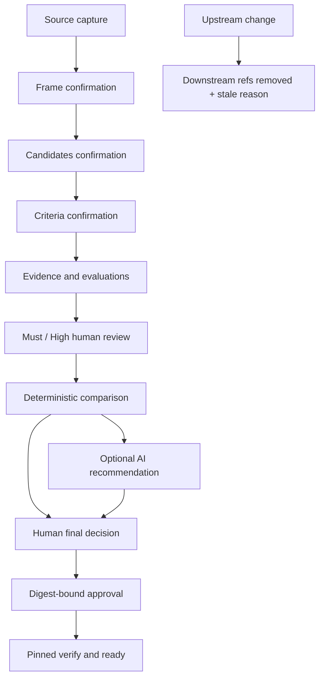

# AI Work Harness

[](https://github.com/5giran/ai-work-harness/actions/workflows/ci.yml)

**AI가 사람이 확정한 문제·후보·기준과 출처가 있는 근거 안에서만 평가와 추천을 만들게
하는 로컬 의사결정 control plane**

AI Work Harness는 AI가 결정을 대신하게 하지 않는다. AI는 초안을 만들고, 사람은 문제를
확인하고 평가를 검토하며 최종 결정을 승인한다. 모든 단계는 불변 snapshot에 연결되어
입력이나 기준이 바뀌면 이전 결정과 승인이 정확한 이유와 함께 stale 처리된다.

[빠른 시작](#빠른-시작) · [사용법](#사용법) · [아키텍처](#아키텍처) ·
[검증 근거](#검증) · [프로젝트 이야기](docs/project-story.md)

> 현재 버전은 `0.4.0` alpha다. 로컬 단일 운영자를 위한 도구이며 인증 시스템, 서명 원장,
> 원격 서비스 또는 production-ready 플랫폼을 주장하지 않는다.

## 프로젝트 소개

### 해결하는 문제

AI는 유용하지만, 실제 결정에서는 다음 질문이 남는다.

- 무엇을 해결하려 했고 누가 그 문제 정의를 확인했는가?
- 어떤 후보를 어떤 기준과 근거로 비교했는가?
- AI 추천과 사람이 선택한 결과가 왜 달랐는가?
- 입력·기준·평가가 바뀐 뒤에도 이전 승인을 신뢰할 수 있는가?

AI Work Harness는 이 질문을 파일 관례가 아니라 schema, state transition과 verifier로
강제한다. 고객지원 운영 방식, 모델 도입, 내부 도구 선택처럼 **AI의 도움은 필요하지만
결정 책임은 사람이 가져야 하는 비교·검토 업무**가 대상이다.

### 핵심 보장

| 경계 | 구현된 통제 |
|---|---|
| 인간 권한 | frame·후보·기준 확인, Must/High 검토, 최종 결정과 승인을 별도 event로 기록 |
| AI 권한 | provider와 MCP는 평가·추천 draft만 생성하고 인간 gate에는 접근하지 못함 |
| 근거 | source bytes와 locator를 SHA-256으로 묶고 추론·사용자 주장을 사실 근거와 구분 |
| 변경 감지 | upstream 변경 시 downstream 활성 참조를 제거하고 stale reason을 기록 |
| 동시 쓰기 | full expected-parent, 5초 writer lock과 atomic pointer replace 사용 |
| 승인 | bundle digest, snapshot, nonce와 만료 시각을 challenge에 binding |
| readiness | 승인된 `select`와 동일 pinned snapshot의 전체 검증이 모두 성공할 때만 `ready=true` |

### 배경

이 프로젝트는 [2026 Cofathon](https://cofathon.getcofa.com/)을 위해 만든 문제 적응형
하네스에서 시작했다. 초기 v1은 낯선 과제에서 성급한 구현을 막기 위해 원문 캡처, 문제
프레임 확인, 실행 경로 승인을 강제했다. 행사 후 이 아이디어를 일반 업무로 확장하면서
중심을 “어떤 실행 경로를 고를까”에서 “사람과 AI가 내린 결정을 어떻게 재검증할까”로
바꿨다.

v1에서 발견한 한계, v2로 일반화한 이유와
포트폴리오 주장의 경계는 [프로젝트 이야기](docs/project-story.md)에 정리했다.

### 기술 구성

- Python 3.11/3.12, frozen dataclass, JSON Schema Draft 2020-12
- RFC 8785 JCS, SHA-256 content-addressed storage
- 선택적 OpenAI Responses API adapter와 공식 Python SDK 기반 stdio MCP
- Vite, Vanilla TypeScript, Ajv, Playwright 기반 오프라인 viewer

## 빠른 시작

### 요구 사항

- Python 3.11 또는 3.12
- 합성 fixture 데모에는 API key와 네트워크가 필요하지 않음

### 설치

```bash
git clone https://github.com/5giran/ai-work-harness.git
cd ai-work-harness
python -m venv .venv
.venv/bin/pip install -e '.[dev]'
```

### 10분 합성 데모

```bash
.venv/bin/python scripts/run_synthetic_decision_demo.py \
  --cli .venv/bin/ai-work-harness
```

데모는 “소규모 한국어 고객문의 triage 운영 방식”을 비교한다.

- 후보: `rules`, `classical-ml`, `llm-assisted`
- Must: privacy, auditability
- fixture 추천: `classical-ml`
- 인간 최종 선택: `rules`
- 후속 criteria 변경: 기존 승인 제거와 `criteria_set_changed` 확인

frame·후보·기준 digest와 approval challenge 값을 직접 다시 입력해야 한다. 데모가 끝나면
승인 snapshot의 `ready=true`, 동일 snapshot의 verify 성공, 변경 후 stale 상태를 확인할 수
있다. 자세한 절차는 [operator runbook](docs/operator-runbook.md)에 있다.

## 사용법

v2는 항상 `decision` namespace를 사용하며 session과 snapshot parent를 명시한다.

```bash
# session 생성
ai-work-harness decision init --session-id <session>

# 입력과 인간 확인
ai-work-harness decision source capture ...
ai-work-harness decision frame import|confirm ...
ai-work-harness decision candidates import|confirm ...
ai-work-harness decision criteria import|confirm ...

# 근거, 평가와 비교
ai-work-harness decision evidence import ...
ai-work-harness decision evaluations import|generate|review ...
ai-work-harness decision compare ...
ai-work-harness decision recommend ...

# 인간 결정과 승인
ai-work-harness decision final import ...
ai-work-harness decision approval challenge|commit ...

# 운영과 검증
ai-work-harness decision status|verify|doctor ...
ai-work-harness decision export-view ...
```

모든 mutation은 `--expected-parent <full-snapshot-sha256>`를 요구한다. 정상 domain 결과와
예상된 오류는 JSON envelope로 출력한다. 전체 명령과 오류 대응은
[operator runbook](docs/operator-runbook.md)을 참고한다.

### legacy v1

기존 `init`, `capture`, `frame`, `route`, `approve`, `status`, `verify`는 v1 의미 그대로
유지된다. v2는 자동 감지하지 않으며 `decision migrate-v1`도 v1 confirmation과 approval을
v2 인간 gate로 승격하지 않는다.

## 아키텍처



```text
.ai-work-harness/v2/
├── objects/sha256/<prefix>/<digest>
└── sessions/<session-id>/
    ├── snapshots/<prefix>/<snapshot-digest>.json
    ├── current.json
    └── writer.lock
```

artifact와 snapshot은 RFC 8785 JCS bytes의 SHA-256으로 주소화된다. `current.json`만 현재
snapshot을 가리키며, mutation은 object와 snapshot을 fsync한 뒤 pointer를 atomic replace
한다. crash 뒤 남은 미참조 object는 활성 상태에 영향을 주지 않고 `decision doctor`가
보고한다.

세부 설계는 [architecture](docs/architecture.md), wire contract는
[data contract](docs/data-contract.md), 공격 모델은 [threat model](docs/threat-model.md)에
기록했다.

## Provider, MCP와 Viewer

- `FixtureProvider`는 동일 입력에 결정적인 평가·추천 payload를 생성한다.
- OpenAI adapter는 외부 전송 전 preview와 digest-bound consent를 요구하고 성공한 run만
  기록한다.
- stdio MCP allowlist에는 confirm, evaluation review, final decision, challenge와 approval
  tool이 없다.
- viewer는 export된 `decision-view.v1.json` 한 파일만 읽으며 schema 또는 digest 검증이
  실패하면 결정 내용을 표시하지 않는다.

선택적 integration은 다음과 같이 설치한다.

```bash
.venv/bin/pip install -e '.[openai,mcp]'
```

정책과 실패 처리 기준은 [provider policy](docs/provider-policy.md)에 있다. PR CI는 live
provider를 호출하지 않는다.

## 검증

```bash
.venv/bin/ruff check .
.venv/bin/ruff format --check .
.venv/bin/mypy src/ai_work_harness
.venv/bin/pytest --cov=ai_work_harness --cov-report=term-missing --cov-fail-under=90
.venv/bin/python -m build

cd viewer
npm ci
npm test
npm run build
npm run test:e2e
```

CI는 Python 3.11/3.12 lint·type·coverage·clean wheel 설치와 Python 3.12의
Ubuntu/macOS/Windows smoke를 실행한다. viewer는 Node 22에서 unit, production build와
Playwright Chromium E2E를 검증한다.

[portfolio evidence map](docs/evidence-map.md)은 다음 주장들을 직접 재현하는 테스트에
연결한다.

- writer 경쟁과 crash 지점에서도 pointer 원자성 유지
- object·snapshot·pointer 변조 fail-closed
- `ready=true`인 terminal snapshot의 verify 성공
- 추천과 다른 인간 선택 허용 및 relation 기록
- criteria 변경 후 승인 제거와 stale graph 유지
- provider 실패 시 pointer 불변과 MCP 인간 gate 부재
- viewer의 one-byte 변조·중복 key·네트워크 요청 거부

## 문서

- [프로젝트 이야기](docs/project-story.md): 코파톤용 v1에서 범용 v2로 확장한 이유
- [Architecture](docs/architecture.md): component, write protocol, stale graph, approval cycle
- [Data contract](docs/data-contract.md): artifact schema, ID, evidence와 evaluation 규칙
- [Operator runbook](docs/operator-runbook.md): 설치, 표준 workflow, 장애 대응과 migration
- [Provider policy](docs/provider-policy.md): Fixture/OpenAI/MCP 권한과 outbound consent
- [Threat model](docs/threat-model.md): 보장하는 것과 주장하지 않는 것
- [ADR](docs/adr/README.md): 주요 설계 결정과 대안

## 로드맵과 제한

현재 범위는 로컬 단일 운영자, UTF-8 text/Markdown 근거와 정성 비교다. SHA-256과 JCS는
drift와 손상을 탐지하지만 작성자 신원이나 악의적인 전체 로컬 재작성은 증명하지 않는다.

remote MCP, 인증·서명, DB/cloud backend, hosted viewer, RAG, multimodal, numeric scoring,
optimization, 자동 GC와 PyPI 배포는 현재 범위 밖이다. `v1.0.0`은 공개 main 병합, release
artifact와 지원 OS의 clean install을 같은 commit에서 검증한 뒤에만 선언한다.

## 라이선스

[MIT](LICENSE)
