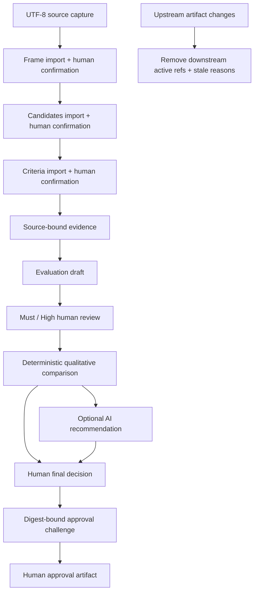

# Architecture

## 목적과 경계

v2는 로컬 단일 운영자가 증거에 묶인 의사결정을 진행하는 control plane이다. AI 모델은
평가·추천 초안을 만들 수 있지만 confirmation, review, final decision, approval을 수행할
수 없다. legacy v1의 routing 구현은 `project.py`에 그대로 남고, v2는
`ai_work_harness.decision` namespace와 `schemas/v2`에 분리된다.

## 구성 요소

- `decision/canonical.py`: strict I-JSON parsing, RFC 8785 JCS, SHA-256.
- `decision/store.py`: blob/artifact CAS, immutable snapshots, current pointer, writer lock,
  expected-parent compare-and-swap, doctor/verify.
- `decision/domain.py`: candidate/criteria/evidence/evaluation/review/final-decision policy.
- `decision/service.py`: 유일한 workflow transition service와 stale dependency graph.
- `decision/providers.py`: 저장소를 모르는 frozen provider port와 deterministic fixture.
- `decision/openai_provider.py`: 선택적인 Responses API draft adapter.
- `decision/mcp_server.py`: closed schema와 정확한 public tool allowlist를 가진 stdio surface.
- `decision/migration.py`: v1을 수정하지 않는 one-way copy/report.
- `viewer/`: export 한 파일만 읽는 offline, read-only browser UI.

## Write protocol

각 mutation은 다음 순서를 지킨다.

1. session writer lock을 최대 5초 동안 획득한다.
2. `current.json`의 전체 digest와 `expected_parent`를 비교한다.
3. 요청, schema, domain policy와 모든 참조를 먼저 검증한다.
4. 새 object를 같은 filesystem의 임시 파일에 쓰고 `fsync` 후 atomic rename한다.
5. 새 snapshot을 같은 방식으로 쓴다.
6. `current.json`을 atomic replace하고 session directory를 `fsync`한다.
7. lock을 해제한다.

따라서 crash가 일어나면 pointer는 이전 snapshot 또는 완성된 새 snapshot을 가리킨다.
pointer 갱신 전 쓰인 object는 orphan일 수 있지만 활성 상태에는 영향을 주지 않는다.

## Artifact graph와 stale

snapshot은 artifact type별 현재 digest ref와 parent snapshot을 가진다. 각 artifact envelope도
자신이 의존하는 상위 artifact digest를 `parents`에 기록한다. service가 frame, candidates,
criteria, evidence 또는 evaluations를 바꾸면 그 산출물에 의존하는 comparison,
recommendation, final decision, challenge, approval ref를 제거한다. 제거 이유는 snapshot에
기록되어 status/export에서 설명된다.

과거 immutable object를 삭제하거나 재작성하지 않는다. “stale”은 과거 기록이 손상됐다는
뜻이 아니라 현재 활성 graph의 승인으로 사용할 수 없다는 뜻이다.

## Pinned verification과 readiness

`status`와 `verify`는 `current.json`을 한 번 읽고 같은 snapshot digest를 끝까지 검증한다.
schema, digest, parent binding, full workflow policy 중 하나라도 실패하면 verified가 아니다.

- `decision_complete=true`: 검증된 `approved`가 `select` 또는 `reject_all`을 승인했다.
- `ready=true`: decision complete이고 final disposition이 `select`이며 전체 verify가 성공했다.
- `reject_all`, `defer`, `request_more_evidence`, `rejected`, `changes_requested`는 ready가 아니다.

## Approval cycle

final decision snapshot `S`에서 challenge/approval을 제외한 decision bundle digest `D`를
만든다. challenge는 UUID4, CSPRNG nonce, `D`, `S`, disposition과 10분 expiry를 묶고 새
snapshot `S1`에 기록한다. commit은 현재 parent가 여전히 `S1`이고 운영자가 전체 `D`,
nonce, challenge ID를 다시 제출했을 때만 approval artifact를 만든다. replay나 intervening
mutation은 current-parent mismatch로 실패한다.
