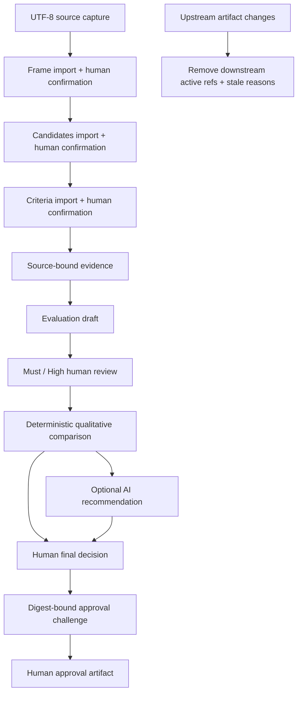
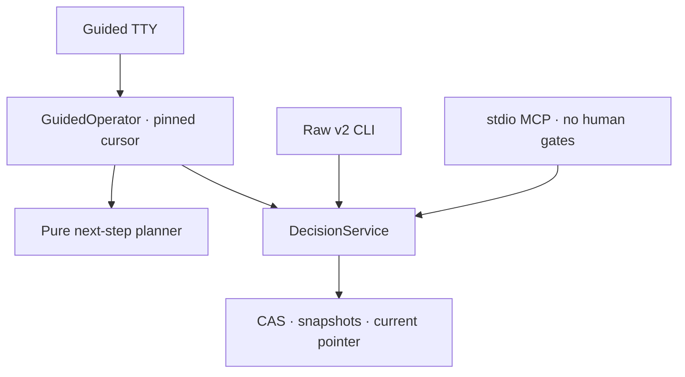

# Architecture

## 목적과 경계

v0.5의 v2는 로컬 단일 운영자가 증거에 묶인 의사결정을 진행하는 control plane이다. AI 모델은
평가·추천 초안을 만들 수 있지만 confirmation, review, final decision, approval을 수행할
수 없다. legacy v1의 routing 구현은 `project.py`에 그대로 남고, v2는
`ai_work_harness.decision` namespace와 `schemas/v2`에 분리된다.

## Guided와 raw 인터페이스

v0.5는 같은 v2 core 위에 두 인터페이스를 유지한다. `decision guide <session-id>`는 로컬
사람을 위한 resumable line-oriented TTY이고, 나머지 `decision ...` subcommand는 자동화와
forensic 운영을 위한 raw JSON protocol이다. stdio MCP는 source/status read, draft mutation,
deterministic comparison, recommendation record와 verify만 공개하고 인간 gate를 제외한 더
좁은 allowlist다.

guide는 snapshot SHA, artifact digest, challenge secret과 full outbound manifest digest의 전달을
담당하지만 core gate를 생략하지 않는다. raw mutation은 계속 full `expected_parent`와 작업별
digest/challenge 값을 요구한다. 두 경로는 같은 schema, validation, stale graph와 service
transition을 사용하므로 활성 semantic payload와 ref graph가 동등하다. 다만 raw의
`digest_challenge`와 guided 전용 confirmation method가 artifact payload에 기록되므로
confirmation 이후 object/snapshot digest 자체가 같을 필요는 없다.

## 구성 요소

- `decision/canonical.py`: strict I-JSON parsing, RFC 8785 JCS, SHA-256.
- `decision/store.py`: blob/artifact CAS, immutable snapshots, current pointer, writer lock,
  expected-parent compare-and-swap, doctor/verify.
- `decision/domain.py`: candidate/criteria/evidence/evaluation/review/final-decision policy.
- `decision/verification.py`: pinned artifact의 단계별 의존성과 도메인 규칙을 읽기 전용으로 재검증.
- `decision/service.py`: 유일한 workflow transition service와 stale dependency graph.
- `decision/guidance.py`: 검증된 immutable state를 semantic stage와 다음 action으로 바꾸는
  side-effect 없는 planner.
- `decision/operator.py`: 사용자가 실제로 본 generation/snapshot을 고정하고 service 호출에
  full `expected_parent`를 주입하는 guided adapter.
- `guided_cli.py`, `guided_io.py`: 한국어/영어 TTY rendering, 입력 재시도와 resumable navigation.
- `decision/providers.py`: 저장소를 모르는 frozen provider port와 deterministic fixture.
- `decision/openai_provider.py`: 선택적인 Responses API draft adapter.
- `decision/mcp_server.py`: closed schema와 정확한 public tool allowlist를 가진 stdio surface.
- `decision/migration.py`: v1을 수정하지 않는 one-way copy/report.
- `viewer/`: export 한 파일만 읽는 offline, read-only browser UI.

## Planner와 pinned state

guided session은 시작 또는 명시적 reload 때 `current.json`을 한 번 읽고 그 digest를 끝까지
검증해 immutable `ValidatedOperatorState`와 `OperatorCursor`를 만든다. planner는 저장소를
읽거나 쓰지 않고 이 state와 명시적인 `observed_at`만 받아 `operator-plan.v1`을 계산한다.
public plan에는 stage, recommended/available action, pending review, final constraint와 sanitized
challenge 상태만 있으며 nonce, challenge ID, full bundle digest 같은 commit binding은
`GuidedOperator` 내부에만 남는다.

모든 guided mutation은 cursor의 pinned digest를 `expected_parent`로 한 번만 제출한다.
내용이 같은 deterministic no-op은 같은 generation/digest를 유지하고, 그 밖의 성공은 정확히
한 generation을 전진한 뒤 새 state를 다시 검증한다. `WRITE_CONFLICT`가 나면 controller는
pinned/current fingerprint를 보여주고 reload 여부를 묻는다. reload는 새 plan을 보여주기만
하며 실패한 mutation을 자동 retry, replay 또는 rebase하지 않는다. 거부하면 conflict exit
`3`으로 종료되어 기존 pinned 검토 경계를 보존한다.

## Write protocol

각 mutation은 다음 순서를 지킨다.

1. session writer lock을 최대 5초 동안 획득한다.
2. `current.json`의 전체 digest와 `expected_parent`를 비교한다.
3. pinned parent의 활성 binding과 workflow 의미를 재검증한 뒤 요청, schema, domain policy와 모든 참조를 검증한다.
4. 새 object를 같은 filesystem의 임시 파일에 쓰고 `fsync` 후 atomic rename한다.
5. 새 snapshot을 같은 방식으로 쓴다.
6. `current.json`을 atomic replace하고 session directory를 `fsync`한다.
7. lock을 해제한다.

따라서 crash가 일어나면 pointer는 이전 snapshot 또는 완성된 새 snapshot을 가리킨다.
pointer 갱신 전 쓰인 object는 orphan일 수 있지만 활성 상태에는 영향을 주지 않는다.
강제 종료는 `writer.lock`을 남길 수 있다. doctor는 lock metadata와 PID 관찰을 별도 보고하며
자동 삭제하지 않는다. PID 재사용 때문에 PID 존재 여부만으로 소유권을 증명할 수 없다.

## Artifact graph와 stale

snapshot은 artifact type별 현재 digest ref와 parent snapshot을 가진다. 각 artifact envelope도
자신이 의존하는 상위 artifact digest를 `parents`에 기록한다. service가 frame, candidates,
criteria, evidence 또는 evaluations를 바꾸면 그 산출물에 의존하는 comparison,
recommendation, final decision, challenge, approval ref를 제거한다. 제거 이유는 snapshot에
기록되어 status/export에서 설명된다.

과거 immutable object를 삭제하거나 재작성하지 않는다. “stale”은 과거 기록이 손상됐다는
뜻이 아니라 현재 활성 graph의 승인으로 사용할 수 없다는 뜻이다.

## Pinned verification과 readiness

`status`와 `verify`는 `current.json`을 한 번 읽고 같은 snapshot digest를 끝까지 검증한다.
schema, digest, parent binding, full workflow policy 중 하나라도 실패하면 verified가 아니다.
`verification.py`는 존재하는 단계의 필수 gate·parent, ID 중복, source excerpt hash, 평가 matrix,
근거와 review를 검사하고 comparison을 재계산한다. 추천의 적격성·근거, 최종 선택의 적격성·
위험 수용·추천 관계도 쓰기 경로와 공유하는 순수 함수로 검사한다. 진행 중 세션은 아직 없는
후속 단계를 요구하지 않는다. 위반은 `WORKFLOW_INTEGRITY_FAILED`(exit `5`)이며 approval,
readiness, operator state와 export도 같은 verifier를 사용한다. 검증은 저장소를 변경하지 않는다.

- `decision_complete=true`: 검증된 `approved`가 `select` 또는 `reject_all`을 승인했다.
- `ready=true`: decision complete이고 final disposition이 `select`이며 전체 verify가 성공했다.
- `reject_all`, `defer`, `request_more_evidence`, `rejected`, `changes_requested`는 ready가 아니다.

## Approval cycle

final decision snapshot `S`에서 challenge/approval을 제외한 decision bundle digest `D`를
만든다. challenge는 UUID4, CSPRNG nonce, `D`, `S`, disposition과 10분 expiry를 묶고 새
snapshot `S1`에 기록한다. commit은 현재 parent가 여전히 `S1`이고 운영자가 전체 `D`,
nonce, challenge ID를 다시 제출했을 때만 approval artifact를 만든다. replay나 intervening
mutation은 current-parent mismatch로 실패한다.
