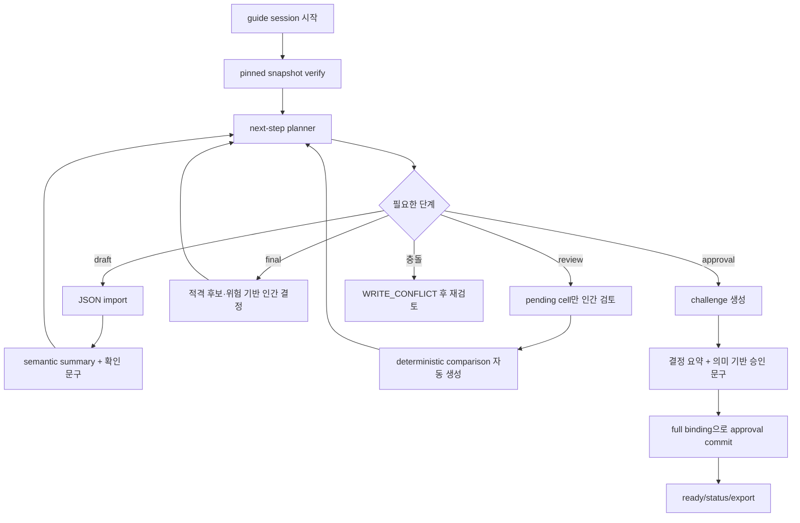

# Guided Decision Operator UX 설계

- 상태: Proposed
- 대상 release: v0.5.0 후보
- 기준 branch: `main`의 v2 decision control plane
- 목표: core 안전 계약을 유지하면서 로컬 운영자의 반복 명령과 digest 복사를 제거한다.

## 1. 결론

현재 v2의 복잡성은 의사결정 절차가 엄격해서만 생긴 것이 아니다. immutable snapshot,
expected-parent CAS, 인간 confirmation, evaluation review, final decision, approval challenge라는
내부 프로토콜을 사람용 CLI가 거의 그대로 노출한 것이 더 큰 원인이다.

다음 두 요구는 구분해야 한다.

1. core는 mutation마다 검토된 정확한 parent snapshot을 검증해야 한다.
2. 운영자가 mutation마다 64자리 parent digest를 직접 복사해야 한다.

1은 안전 불변식이고 2는 현재 CLI의 구현 선택이다. 사람용 guided layer가 화면에 표시한
snapshot을 메모리에 고정하고 그 full digest를 `DecisionService`에 전달해도 CAS는 그대로
작동한다. 중간에 다른 writer가 current를 바꾸면 기존과 똑같이 `WRITE_CONFLICT`로
실패한다.

따라서 다음의 이중 interface를 만든다.

- **Raw interface:** 기존 `decision` 하위 명령을 그대로 보존한다. CI, shell automation,
  MCP backend, 장애 분석과 정밀 재현에 사용한다.
- **Guided interface:** 한 session을 한 번 선택하고 현재 상태에 필요한 다음 인간 작업만
  안내한다. parent, artifact digest, challenge 필드는 내부에서 전달한다.

Guided interface는 core를 우회하거나 별도의 workflow 규칙을 소유하지 않는다. 모든 실제
mutation은 계속 `DecisionService` 한 곳을 통과한다.

이 판단은 다음 현재 구현을 기준으로 한다.

- [`cli.py`](../src/ai_work_harness/cli.py#L27-L54): session과 expected parent를 모든 leaf
  command argument로 반복한다.
- [`service.py`](../src/ai_work_harness/decision/service.py#L253-L273): 모든 mutation이 lock 안에서
  expected parent와 active binding을 검증한다.
- [`store.py`](../src/ai_work_harness/decision/store.py#L104-L137): current가 caller가 본 parent와
  달라지면 `WRITE_CONFLICT`로 실패한다.
- [`run_synthetic_decision_demo.py`](../scripts/run_synthetic_decision_demo.py#L52-L99): demo wrapper가
  성공 응답의 parent를 이미 자동 전달한다.
- [`service.py`](../src/ai_work_harness/decision/service.py#L2331-L2368): status가 pinned snapshot의
  verify를 포함한다.
- [`service.py`](../src/ai_work_harness/decision/service.py#L2385-L2408): service의 viewer export는
  current snapshot 기본값을 이미 지원한다.
- [`threat-model.md`](threat-model.md): 보호 대상은 실수, drift, 동시 write와 제한된 untrusted
  input이며 로컬 actor 신원 인증은 범위 밖이다.

## 2. 현재 사용 경험이 복잡해진 이유

### 2.1 저장 프로토콜과 operator UX를 같은 interface로 취급했다

`DecisionStore`가 full expected-parent를 요구하는 것은 stale write 방지에 필요하다. 그러나
CLI도 모든 mutation에서 같은 값을 필수 argument로 요구한다. 그 결과 저장 계층의
compare-and-swap token이 운영자의 작업 항목이 되었다.

현재 합성 데모의 승인 완료 경로는 다음을 요구한다.

- 약 22회의 CLI 호출
- init 이후 mutation 사이에서 최대 15회의 parent digest 전달
- frame, candidates, criteria confirmation을 위한 artifact digest 3회 재입력
- approval을 위한 challenge ID, nonce, bundle digest 3회 재입력

데모 스크립트도 이를 그대로 수행하지 않고, 성공 응답의 `snapshot_sha256`를
`self.parent`에 저장해 다음 mutation에 자동 주입한다. 이미 repository 내부에 “사람이
parent를 전달하지 않아도 core 안전성은 유지된다”는 사례가 있는 셈이다.

### 2.2 artifact lifecycle을 명령 목록으로 노출했다

frame, candidates, criteria의 import와 confirmation은 서로 다른 이벤트여야 한다. 하지만
현재는 운영자가 다음 orchestration까지 직접 해야 한다.

```text
import
→ status
→ refs에서 artifact digest 검색
→ digest 복사
→ 새 parent digest 복사
→ confirm
```

분리된 snapshot은 필요하지만, 여섯 단계의 shell 조작은 필요하지 않다.

### 2.3 machine interface를 primary operator interface로 사용했다

정상 결과와 domain error의 JSON envelope은 자동화와 테스트에 적합하다. 반면 사람은 JSON
전체에서 `snapshot_sha256`, `refs`, pending gate와 필요한 risk acknowledgement를 직접 찾아야
한다. 현재 status는 무결성과 lifecycle을 설명하지만 “지금 무엇을 해야 하는가”를 말하지
않는다.

### 2.4 인간의 주의를 cryptographic value 재입력으로 대신했다

64자리 digest, UUID와 nonce는 기계가 정확히 비교하기에는 좋지만 사람이 의미를 검토하기에는
나쁘다. 같은 terminal이 출력한 값을 그대로 다시 붙여넣는 행위는 다음을 증명하지 않는다.

- 운영자가 후보와 기준 내용을 읽었다.
- AI 추천과 인간 선택의 차이를 이해했다.
- 선택 후보의 unresolved risk를 확인했다.
- terminal 앞의 사람이 인증된 actor다.

현재 threat model도 `identity_verified=false`를 명시한다. 따라서 guided mode의 인간 질문은
읽을 수 없는 세 값보다 disposition, 선택 후보와 위험을 직접 드러내야 한다. full digest,
nonce와 parent binding은 core 내부에서 계속 검증한다.

### 2.5 결정적 파생 단계와 명시적 인간 단계를 구분하지 않았다

`compare`는 core가 평가와 review에서 결정적으로 만드는 파생 artifact다. 여기에 새로운 인간
판단은 없다. 반면 confirmation, review, final decision과 approval에는 명시적 인간 행동이
필요하다. 현재 CLI는 두 종류를 모두 같은 수동 mutation으로 취급한다.

### 2.6 상태 확인과 무결성 확인이 중복된다

`status`는 pinned snapshot에 대해 내부적으로 `verify`를 실행한다. 정상 operator flow에서
같은 snapshot을 다시 `verify --snapshot ...` 하는 것은 안전성을 추가하지 않는다. 독립
`verify`는 CI, forensic check와 특정 historical snapshot 검증에는 계속 필요하다.

### 2.7 service가 이미 지원하는 기본값을 CLI가 막는다

`DecisionService.export_view()`는 snapshot을 생략하면 current snapshot을 사용한다. 그러나
CLI는 `export-view --snapshot`을 필수로 요구한다. 사용자가 현재 승인 결과를 export하는 가장
흔한 경로에서 불필요한 digest 복사를 만든다.

## 3. 바꾸면 안 되는 것

단순화를 위해 다음 계약을 완화하거나 우회하지 않는다.

### 3.1 저장소와 무결성

- RFC 8785 JCS와 SHA-256 content address
- immutable object와 snapshot
- full expected-parent compare-and-swap
- 5초 writer lock, fsync, atomic pointer replace
- mutation 전 active binding 검증
- pinned snapshot 기준 status와 verify
- crash 후 orphan은 무해하게 남기고 doctor가 보고하는 정책

Guided mode도 mutation 직전에 current를 몰래 다시 읽어 요청을 최신 상태에 자동 적용하지
않는다. 사용자가 본 pinned parent와 current가 다르면 반드시 실패한다.

### 3.2 인간 gate

- frame, candidates, criteria draft와 confirmation의 분리
- AI/fixture Must·High evaluation의 인간 review
- recommendation과 final decision의 분리
- final decision과 approval의 분리
- challenge snapshot과 approval snapshot의 분리
- `identity_verified=false`
- approval reason 필수

하나의 guided process 안에서 두 snapshot을 연속 생성할 수는 있지만, 하나의 artifact나
하나의 mutation으로 합치지 않는다.

### 3.3 의사결정 정책

- Must는 reviewed effective assessment가 `meets`일 때만 통과
- 부적격 후보 select 금지
- 필요한 risk acknowledgement 누락 금지
- `defer`와 `request_more_evidence` approval 완료 금지
- recommendation 자동 승인 금지
- scoring, weight와 자동 winner 금지
- upstream 변경 시 downstream active ref 제거와 stale reason 유지

### 3.4 AI와 MCP 권한 경계

- provider는 draft payload만 반환
- provider에 repository handle을 제공하지 않음
- MCP에 confirm, review, final, challenge, approval tool을 추가하지 않음
- 외부 호출 전 preview와 exact outbound consent 유지
- manifest 변경 시 기존 consent 재사용 금지
- provider 실패 시 current pointer 불변

### 3.5 v1과 raw v2 호환성

- legacy v1 명령과 의미를 바꾸지 않음
- v2의 `decision` namespace 유지
- 기존 raw leaf command, JSON envelope와 exit code 유지
- raw mutation과 MCP mutation의 explicit expected parent 유지
- raw approval commit의 full challenge arguments 유지

Guided mode를 도입하면서 기존 명령의 기본 의미를 바꾸지 않는다.

## 4. 바꿔야 하는 것

### 4.1 사람용 state navigator 추가

새 primary operator command는 다음으로 고정한다.

```bash
# 새 session 시작 또는 기존 session 재개
ai-work-harness decision guide triage

# 영어 화면
ai-work-harness decision guide triage --lang en
```

project root가 현재 directory가 아니면 기존 global `--root`를 한 번만 쓴다.

```bash
ai-work-harness --root /path/to/project decision guide triage
```

session ID를 process 시작 시 한 번만 선택한다. project 전역이나 사용자 home에 “마지막 active
session”을 저장하지 않는다. 숨은 global session은 다른 프로젝트나 다른 결정을 실수로
수정할 위험이 있기 때문이다.

session이 없으면 guide는 root와 session ID를 먼저 보여주고 `y/N`으로 생성 여부를 묻는다.
TTY 확인을 이 질문과 session 생성보다 먼저 수행하므로 pipe나 CI의 실수로 상태가 생기지
않는다. 기존 session이면 active refs에서 현재 단계를 계산해 그대로 재개한다. 사용자 home이나
project 설정에 마지막 active session을 저장하지 않는다.

### 4.2 순수한 next-step planner 추가

Guided UI가 자체적으로 workflow 조건을 재구현하지 않도록, 검증된 pinned snapshot에서
operator plan을 만드는 read-only planner를 둔다.

```text
operator-plan.v1
├── schema_version / observed_at / stage
├── recommended_action / available_actions[]
├── source·artifact·producer summary
├── pending_reviews[]
├── final_decision_constraints
├── sanitized challenge state
├── decision_complete / ready
└── stale_reasons[]
```

planner는 mutation하지 않으며 다음 정보만 계산한다.

- 현재 활성 artifact와 confirmation
- 완료되지 않은 gate
- AI/fixture evaluation 중 review가 필요한 cell
- comparison 생성 가능 여부
- final decision에서 필요한 risk acknowledgement
- active challenge의 만료 여부. 현재 시각은 `observed_at`으로 명시해서 planner에 전달한다.
- status가 이미 반환하는 verified, ready, stale reason

동일 planner를 사람이 읽는 `guide`와 JSON read command가 공유한다.

```bash
ai-work-harness decision next --session-id triage
```

`decision next`는 기존 JSON envelope을 사용하고 mutation하지 않는다. shell integration이나
향후 UI가 raw artifact graph를 해석하지 않고도 다음 작업을 알 수 있게 한다.

공개 plan에는 nonce, full challenge binding, raw source와 excerpt를 넣지 않는다. guide가 쓰는
내부 `ValidatedOperatorState`만 commit에 필요한 full binding을 가지며 JSON serialization 대상이
아니다. read query는 current를 한 번만 읽고 같은 pinned snapshot을 fail-closed verify한다.

### 4.3 pinned parent cursor를 process 내부에서 관리

Guided session은 매 화면 단위를 다음 순서로 처리한다.

1. current pointer를 한 번 읽는다.
2. 같은 pinned snapshot을 verify하고 operator plan을 만든다.
3. session, generation, lifecycle과 digest fingerprint를 표시한다.
4. 사용자가 payload와 의미를 검토한다.
5. 사용자가 행동을 확정하면 pinned full digest를 `expected_parent`로 전달한다.
6. 성공 응답의 새 full digest만 다음 cursor로 채택한다.
7. 실패하면 cursor를 갱신하지 않는다.

다른 writer가 2와 5 사이에 변경하면 store의 CAS가 실패한다. Guided layer는 요청을 새
parent로 자동 retry하거나 rebase하지 않는다. 실제 current와 stale reason을 보여준 뒤,
운영자가 새 상태를 다시 검토하고 명시적으로 재시도하게 한다.

### 4.4 import와 confirmation을 한 guided interaction으로 연결

frame, candidates, criteria는 전체 semantic summary와 digest fingerprint를 보여준 뒤
`확인 / 수정 / 종료`를 선택하게 한다.

```text
현재 단계: Frame 작성
입력 JSON 경로: decisions/frame.json

[검증된 요약]
- 업무 사용자: 고객지원 운영자
- 막힌 결정: 문의 triage 운영 방식 선택
- 포함 범위: ...
- 미확정 질문: 0개

Artifact SHA-256: 73ab...91c2
선택: [확인/수정/종료]
```

import와 confirm은 내부적으로 두 service mutation이다.

1. import snapshot을 commit한다.
2. import 결과를 다시 읽고 사용자에게 semantic summary와 full digest를 표시한다.
3. 사용자가 화면의 전체 의미를 검토하고 `확인`을 선택한다.
4. guide가 full artifact digest와 새 parent를 `DecisionService.confirm()`에 전달한다.

guided confirmation은 `method=guided_semantic_review`로 기록하고 raw confirmation의
`digest_challenge`는 유지한다. fingerprint는 인간의 대상 혼동을 줄이는 표시일 뿐
cryptographic security boundary가 아니다. core는 항상 full digest를 비교한다. 사용자가
취소하면 import된 draft는 남고 confirmation은 생기지 않는다. 재개하면 같은 draft 검토부터
이어진다.

draft가 없으면 반복 가능한 guided form, JSON import, 종료 후 agent draft 작성 중 하나를
고른다. 기존 local/agent/MCP draft가 있으면 새로 만들기 전에 그 내용을 먼저 검토한다. 긴
payload는 사용자가 명시한 외부 경로에 JSON draft로 저장할 수 있지만 hidden draft 파일은
만들지 않는다. source는 여러 개를 캡처할 수 있고 하나 이상이면 frame으로 진행할 수 있다.

### 4.5 review를 pending cell 중심으로 제시

평가 JSON 전체를 다시 작성하게 하지 않고 planner가 review가 필요한 Must·High cell만
안정된 candidate/criterion 순서로 표시한다.

각 cell에서 보여줄 내용은 다음과 같다.

- candidate와 criterion
- priority
- AI/fixture assessment와 rationale
- 연결된 source observation
- 현재 uncertainty
- 허용 행동: concur, override, request revision

`override`를 선택하면 effective assessment와 비어 있지 않은 reason을 추가로 요구한다.
일반적인 concur/override 답변은 메모리에 모아 필요한 cell이 모두 완료된 payload를 한 번
저장한다. 하나 이상의 `request_revision`이 있으면 아직 보지 않은 required cell이 남아도
immutable review artifact를 기록할 수 있다. 이 상태에서는 comparison을 차단하고 같은
evaluation에 review를 덮어쓸 수 없다. 새 evaluation을 import해야 기존 review가 stale 된다.

local operator가 직접 import한 evaluation에는 기존 정책대로 불필요한 review를 만들지 않는다.

### 4.6 결정적 comparison 자동 생성

필요한 review가 완료되고 comparison이 없으면 guide가 다음 진행 직전에 `compare()`를
자동 호출한다. 호출 전 별도 인간 승인을 묻지 않는다. comparison은 새로운 인간 판단이
아니며 같은 input에서 core가 결정적으로 계산하기 때문이다.

자동 호출도 pinned expected parent를 사용한다. 충돌이나 검증 실패를 숨기지 않는다. raw
`decision compare`는 그대로 남는다.

### 4.7 recommendation을 명시적인 선택 단계로 유지

comparison 이후 다음 선택지를 보여준다.

```text
1. Fixture/OpenAI 추천 초안을 만든다
2. 추천 없이 인간 최종 결정을 기록한다
3. 종료하고 나중에 계속한다
```

추천은 선택 사항이며 guide가 자동 생성하지 않는다. OpenAI를 선택하면 기존 preview →
manifest fingerprint 확인 → consent → provider call을 같은 guided process에서 연결하되 각각의
artifact와 snapshot은 유지한다. network call 전 provider, model, source byte count와 prompt/input
fingerprint를 사람이 읽을 수 있게 표시한다.

### 4.8 final decision을 semantic form으로 수집

guide는 comparison에서 계산된 후보 적격성과 위험을 이용해 다음을 순서대로 묻는다.

1. `select`, `reject_all`, `defer`, `request_more_evidence`
2. select인 경우 eligible candidate 한 개
3. recommendation이 있으면 `same` 또는 `different` 예상 관계 표시
4. reason
5. core가 요구하는 risk acknowledgement 목록

운영자는 위험 cell ID를 직접 작성하지 않는다. 다음처럼 의미를 보고 선택한다.

```text
[필수 확인] rules / operating-cost
평가: partial · priority: medium · AI cell 미검토
이 위험을 인지하고 선택을 계속합니까? [y/N]
```

guide가 확인된 항목을 exact `candidate_id/criterion_id` 목록으로 변환한다. 최종 payload를
보여준 후 한 번 더 확인하고 `import_final_decision()`을 호출한다. core의 누락 검사는 계속
최종 방어선으로 남는다.

### 4.9 challenge/commit을 한 guided approval interaction으로 연결

approval 화면은 cryptographic field보다 승인 의미를 먼저 보여준다.

```text
최종 결정: rules 선택
AI 추천: classical-ml
관계: different
확인한 위험: rules/operating-cost

Decision bundle: 782f...19ac
Challenge 만료까지: 09:42
승인 문구: APPROVE rules 782f44a109bd
> 
승인 이유: 
```

내부 순서는 유지한다.

1. `create_approval_challenge()`로 bundle, nonce, parent, disposition과 expiry를 기록한다.
2. challenge snapshot을 pinned parent로 채택한다.
3. guide가 bundle과 final decision에서 semantic summary를 만든다.
4. 운영자가 disposition, candidate와 12자리 bundle fingerprint가 포함된 문구를 입력한다.
5. 비어 있지 않은 reason을 입력한다.
6. guide가 full challenge ID, nonce, bundle digest와 challenge snapshot을
   `commit_approval()`에 전달한다.

nonce는 화면에서 복사하게 하지 않는다. challenge artifact와 commit binding에는 그대로
남는다. guide가 challenge 생성 뒤 종료되면 다음 실행은 active challenge를 읽어 다음처럼
처리한다.

- 유효함: 같은 semantic summary를 다시 보여주고 commit 가능
- 만료됨: 기존 commit 시도 없이 새 challenge 발급 여부를 질문
- intervening mutation 발생: challenge가 active하지 않으므로 새 상태 검토로 복귀

`approved`, `rejected`, `changes_requested`마다 서로 다른 확인 동사를 사용한다. 예를 들어
`REJECT <fingerprint>`, `REQUEST CHANGES <fingerprint>`로 disposition 혼동을 막는다.

active human approval이 있으면 같은 final decision에 새 challenge를 만들지 않는다.
`rejected`와 `changes_requested` 뒤에는 final의 disposition, candidate, reason 또는 risk
acknowledgement가 실제로 달라지거나 upstream artifact가 바뀌어 기존 final이 stale 되어야 한다.
`recorded_at`만 달라지는 동일 final 재import와 approved decision의 중복 challenge도 core가
거부한다.

### 4.10 status, verify와 export 역할 정리

- guide의 각 화면은 pinned status의 `verified`, lifecycle, stale reason을 요약한다.
- 정상 완료 화면은 status가 이미 verify한 결과를 사용한다.
- `decision verify`는 raw/forensic/CI 명령으로 유지한다.
- guided 완료 화면에서 current snapshot export를 제안한다.
- raw `export-view --snapshot`은 기존대로 지원한다.
- `--snapshot`을 생략한 raw export는 service의 기존 동작처럼 current를 사용하도록 허용한다.

## 5. 목표 사용자 여정



정상적인 신규 session에서 운영자가 shell에 입력하는 명령은 하나다.

```bash
ai-work-harness decision guide triage
```

운영자는 과정 중 payload 경로, review 판단, final decision, approval phrase와 reason을
입력한다. snapshot SHA, artifact full digest, challenge ID와 nonce를 shell argument로 복사하지
않는다.

## 6. 코드 경계

다음 구조를 권장한다.

```text
src/ai_work_harness/decision/
├── guidance.py       # immutable OperatorPlan DTO와 pure next-step planner
├── operator.py       # pinned cursor와 DecisionService orchestration
└── service.py        # 기존 단일 state transition authority

src/ai_work_harness/
├── guided_cli.py     # TTY rendering/input; injectable console port
└── cli.py            # parser와 raw dispatch, guide entry 등록
```

### `guidance.py`

- 저장소에 쓰지 않는다.
- provider를 호출하지 않는다.
- validated read model만 입력으로 받는다.
- 같은 validated state와 명시적인 `observed_at`에는 동일 plan을 반환한다.
- state별 next step과 필요한 review/risk를 계산한다.

### `operator.py`

- full pinned parent cursor를 소유한다.
- `DecisionService` public method만 호출한다.
- 성공 응답에서만 cursor를 갱신한다.
- import→confirm, challenge→commit orchestration을 담당한다.
- policy 오류를 잡아 성공으로 바꾸지 않는다.
- conflict에서 자동 retry하지 않는다.

### `guided_cli.py`

- 사람이 읽는 summary와 prompt만 소유한다.
- domain eligibility나 required risk를 자체 계산하지 않는다.
- `ConsolePort`를 주입해 실제 terminal 없이 interaction test가 가능해야 한다.
- TTY가 아니면 `INTERACTIVE_TERMINAL_REQUIRED`로 실패한다.
- Ctrl-C는 exit 130, EOF는 `INTERACTIVE_INPUT_CLOSED`와 exit 2로 끝내며 새 mutation을
  만들지 않는다.

### `service.py`

가능하면 기존 mutation signature와 정책을 바꾸지 않는다. guide가 필요한 validated read
model을 만들기 위한 read-only query method만 추가한다. guide가 `service.store`를 직접 읽는
구조는 피한다. provider와 달리 local UI는 신뢰 경계 안에 있지만, storage schema를 UI에
결합하면 향후 refactor와 검증 책임이 흐려진다.

## 7. output과 오류 계약

기존 raw command는 현재 계약을 유지한다.

- 성공과 예상된 domain error: JSON envelope
- exit `0`: 성공
- exit `2`: input/schema/policy
- exit `3`: stale/CAS/lock
- exit `4`: provider/transport
- exit `5`: integrity
- exit `1`: unexpected internal error

`decision guide`만 명시적으로 interactive text surface다. error code와 process exit code는 raw
계약과 같게 유지하고, 마지막에 다음 정보를 짧게 표시한다.

```text
Session: triage
Generation: 14
Snapshot: 782f44a109bd...
State: decision_recorded
Verified: yes
Next: approval challenge
```

`decision next`는 JSON이므로 자동화가 guided presentation을 parsing할 필요가 없다.

## 8. 중단, 실패와 복구

| 상황 | 동작 |
|---|---|
| 명시적 종료 | exit 0; 현재 resumable state를 표시 |
| prompt 중 Ctrl-C | exit 130; stack trace 없이 현재 상태 유지 |
| prompt 중 EOF | `INTERACTIVE_INPUT_CLOSED`, exit 2; 현재 상태 유지 |
| import 성공 후 confirm 취소 | draft snapshot 유지; 재개 시 같은 artifact 확인부터 시작 |
| provider 실패 | 기존 정책대로 pointer 불변; retry 여부를 사용자에게 맡김 |
| writer conflict | 자동 retry 금지; 충돌을 먼저 알리고 사용자가 reload를 선택한 경우만 새 plan 표시 |
| challenge 생성 후 종료 | active challenge가 유효하면 재개, 만료면 새 challenge 여부 질문 |
| integrity failure | 모든 mutation 중단; doctor와 pinned verify 안내 |
| upstream 변경으로 stale | 과거 approval 복구 금지; 제거된 gate부터 다시 진행 |

Guided layer는 rollback이나 hidden checkpoint를 만들지 않는다. immutable history와 current
pointer가 이미 복구에 필요한 사실을 소유한다.

## 9. 만들지 않을 것

- 모든 gate를 한 payload로 선언해 일괄 승인하는 `apply workflow.json`
- current가 바뀌면 최신 parent에 mutation을 자동 재적용하는 retry
- AI 추천 뒤 자동 final decision 또는 approval
- MCP의 human gate tool
- 사용자 home에 저장하는 global active session
- raw CLI에서 expected parent 기본 생략
- digest, challenge나 verification을 없앤 “간편 모드”
- comparison scoring 또는 자동 winner
- interactive UI만 통과하는 별도 domain policy
- 이번 첫 구현에서 TUI framework, web backend, database 또는 remote session

## 10. 구현 순서

### PR 1 — Planner와 core 정책 기반 (`feat/guided-decision-ux`)

- `OperatorPlan`, step enum과 pure planner
- `decision next` JSON command
- 모든 lifecycle, stale, pending review, required risk 상태 단위 테스트
- mutation 없는 read-only contract 검증
- `request_revision` 기록/comparison 차단과 동일 final 재승인 금지
- guided/raw 이중 interface ADR

### PR 2 — 로컬·Fixture Guided Workflow (`feat/guided-decision-workflow`)

- injectable console port
- `decision guide <session> [--lang ko|en]`
- source capture, frame/candidates/criteria import와 semantic confirmation
- 성공 시 parent 자동 전달, conflict fail-closed
- 취소와 재개 transcript test

- pending Must·High review collector
- deterministic compare 자동 실행
- optional recommendation 분기
- eligible candidate와 required risk 기반 final decision form
- semantic approval phrase
- full challenge binding의 내부 전달
- 만료 challenge 재개/재발급
- ready summary와 current snapshot export

### PR 3 — OpenAI·Agent 재개, 문서와 release (`feat/guided-decision-integrations`)

- OpenAI preview → exact consent → run과 실패 후 재개
- 기존 MCP draft 감지; MCP human gate allowlist는 그대로 유지
- README 기본 사용법을 guided flow로 교체
- raw 명령을 Advanced/Automation으로 이동
- operator runbook에 raw와 guided 복구 절차 병기
- 합성 demo transcript를 “명령 수”가 아니라 “인간 판단 지점” 중심으로 갱신
- version `0.5.0`

## 11. 합격 기준

### 사용성

- 신규 합성 session부터 approved select까지 한 번의 guide invocation으로 완료할 수 있다.
- 중단하면 같은 session을 한 번 지정해 재개할 수 있다.
- 운영자는 full snapshot SHA, artifact SHA, challenge ID와 nonce를 복사하지 않는다.
- 화면은 항상 root, session, generation, lifecycle과 digest fingerprint를 표시한다.
- 다음 행동은 한 번에 하나의 결정만 요구한다.

### 안전성

- guide와 raw flow에 같은 Clock/IdSource와 같은 입력을 주면 decision draft payload와
  동등한 snapshot ref graph를 만든다. confirmation method의 의도적인 presentation 차이만
  허용한다.
- guide 경로로 human gate를 건너뛸 수 없다.
- import와 confirmation, challenge와 approval은 각각 별도 snapshot이다.
- concurrent writer가 개입하면 `WRITE_CONFLICT`이며 자동 retry하지 않는다.
- stale, nonce mismatch, bundle mismatch, expiry와 replay test가 그대로 통과한다.
- `ready=true`이면 같은 pinned snapshot의 verify가 성공한다.
- provider/MCP 권한 allowlist가 변하지 않는다.

### 호환성

- 기존 v1 test와 v2 raw CLI test가 변경 없이 통과한다.
- raw output JSON field와 exit code가 바뀌지 않는다.
- 기존 scripts와 MCP client는 migration 없이 동작한다.
- `decision export-view --snapshot ...`도 계속 동작한다.

### 테스트

- planner state table unit test
- scripted console golden transcript
- prompt 취소 전후 pointer 불변 test
- import 후 confirm 취소와 재개 test
- 각 prompt 사이 concurrent mutation fault injection
- expired challenge resume test
- provider refusal/timeout 후 resume test
- raw와 guided graph equivalence test
- non-TTY fail-closed test

## 12. 문서 표현 원칙

README에서 raw protocol 전체를 기본 사용법으로 먼저 보여주지 않는다. 첫 사용자는 다음 세
가지만 이해하면 된다.

1. source와 판단 자료를 준비한다.
2. `decision guide <session>`을 실행해 화면의 인간 판단을 수행한다.
3. `ready`와 offline export를 확인한다.

expected-parent, JCS, nonce, full challenge commit은 제품이 제공하는 안전 근거로 설명하되,
일상적인 사용자가 매번 직접 조작해야 하는 절차로 소개하지 않는다. raw command 표는
automation과 복구가 필요한 운영자를 위한 별도 절에 둔다.

이 재설계의 목표는 단계를 숨기는 것이 아니다. 사람이 판단해야 할 단계는 더 잘 보이게
하고, 기계가 전달해야 할 값은 기계가 전달하게 만드는 것이다.
